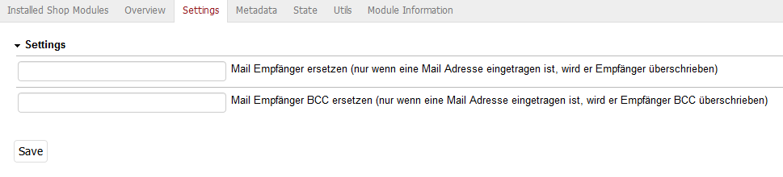

# Oxid mail receiver

## Description

Send all mails to a defined mail address or add to all mails a BCC.
Also in this module you can enable a fix if you have problems when the shop hosted at a Profihost server.
 
    https://github.com/vanilla-thunder/fix-phpmailer

This extension was created for Oxid 6.x.

## Install

1. Copy files into following directory

        source/modules/rs/mailreceiver
        
2. Add to composer.json at shop root
  
        "autoload": {
            "psr-4": {
                "rs\\mailreceiver\\": "./source/modules/rs/mailreceiver"
            }
        },

3. Refresh autoloader files with composer in the oxid root directory.

        composer dump-autoload
        
4. Enable module in the oxid admin area, Extensions => Modules
5. Changes settings in the module itself

